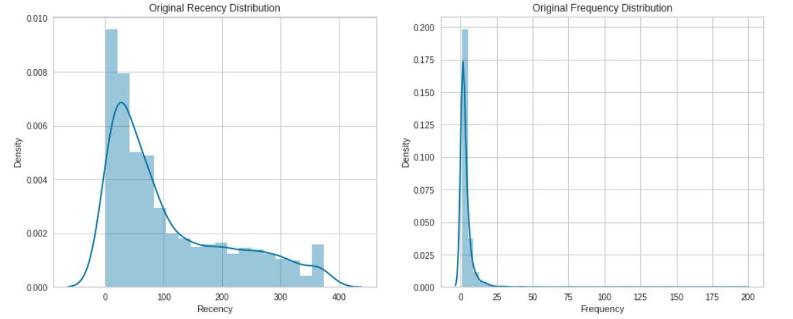

# 1. Business Objective Overview
Customer base is considered a crucial intangible asset of any business entity, in that sense, they must be highly valued and properly managed. Customer segementation is a major step toward maximized marketing strategies by ensuring more personalized offers and better communication channels based on our understaninf of customer needs. In this project, we will conduct RFM analysis based on historcial customer data to segment our customers in terms of Recency, Frequency, and their Monetary Value. 

## 1.1 RFM Analysis
Recency, Frequency, Monetary Value is a marketing analysis tool used to identify a company's or an organization's best customers by using certain measures. The RFM model is based on three quantitative factors:
- Recency: How recently a customer has made a purchase
- Frequency: How often a customer makes a purchase
- Monetary Value: How much money a customer spends on purchases

While each factor's significance can vary from industry to another, generally Recency is more important than other both for its more predictive, while frequency is more important than monetary value, that’s the reason of their order RFM. So, recency makes the probability of a customer purchase higher even when his frequency is lower than other customers. 

***
# 2. Data set Source:
our Data set is provided by UCI Machine Learning and can be accessed [here](https://archive.ics.uci.edu/ml/datasets/online+retail) along with its description.

***
# 3. Model Development 

We will use K-means algorithm to perfrom customer clustering as being a fast and efficient unsupervised learning method, However our data must meet its assumptions of being normally distributed and have the same mean and variance, therefore we will manage skewness using Logarithmic and Box-Cox transformation for Recency and Frequency, however using Cubic Root transformation instead for Monetary Value due to having negative values then we perfrom feature scaling to be in line with K-means assumptions. 

 ## 3.1 Hyperparameter Tuning
  choosing the right K ensures maximum performance of K-means algorithm, we use the elbow method, a mathematical optimization approach to reach an approximation, to identify the number of clusters as follows:
          
          we can see that our best bet would be 3 to 5 clusters where values start to reduce more linearly and the curve is no longer falling steeply, However, we can perform             silhouette analysis to reach a more decisive decision.
   ##  3.2 Silhouette Analysis
   we conduct Silhouette Analysis to avoid both overfitting and underfitting by determining our optimal number of clusters.
         
         
        silhouette analysis is based on two main principles:
- similariy in thickness of silhouette plots which represent each cluster

- presence of negative values, meaning that b(i) is higher than a(i)
       
accordingly, we can exclude all numbers of clusters other than 2 and 3. however, we can see that 3 clusters achieve less fluctuation in thickness of silhouette plots, so we      choose 3 to be our number of clusters to achieve the maximum performance.
## 3.3 Principal Component Analysis
we conduct PCA to integrate a multi-dimensional space (columns) into 2 dimensions to easily visualize our clusters on a 2-D graph.
 
 ***
# 4. Analysis 

 
 After performing customer segmentation exploiting RFM marketing analysis tool, we now have a more cohesive picture of our customer base, to conclude our clustering analysis, we can observe 3 distinct groups where our customers fit in as follows:

- group 1 are our long-standing customers, those who come last in terms of recency, Frequency or even Monetary Value, as we can see they made less orders with a low monetary value a long time ago.

> Strategy: we can design more specifically targeted communication that help convert them into more loyal, higher RFM value customers.

- group 2 are our loyal customers, they come first in terms of Frequency with large-value orders, However, they are the second most recent customers who made purchases, WE CAN'T LOSE THEM.

> Strategy: a more personalized offers can be promoted using product recommendation based on their past purchases in order to increase engagement and ensure higher customer retention rate.

- group 3 are our new customer base, they are the most recent customers who made purchases, slightly higher in monetary value than group 1, However less frequent than group 2, which makes perfect sense they are newly introduced to our product.

> Strategy: triggered welcome emails can be used to ensure engagement, establishing personal connection, encourage them to make more purchases with introductory offers.

# 5. Conclusion
In this Project, we applied Machine Learning to a real-world business case where it can provide a more cohesive picture into our customer base, using K-means algorithm along with meeting its assumptions, we have segemnted our customers into 3 clusters which Marketing department can utilize to ensure business growth, establishing better strategies and achieve higher retention rate.

     
